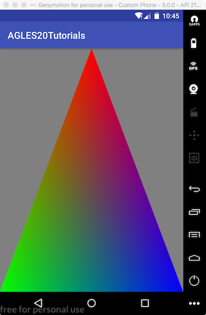

# AGLES20Tutorials
---

Android平台下OpenGL ES 2.0教程代码。
原文[Android OpenGL ES 2.0 Tutorials](https://linuxparachen.gitbooks.io/android-opengl-es-2-0-tutorials/content/)

author：陈占洋

email：<zhanyang.chen@gmail.com>

内容禁止用于商业用途，侵权必究。

[License](https://github.com/LinuxparaChen/AGLES2.0Tutorials/blob/master/LICENSE)

案列效果：
1. 三角形绘制

2. 立方体绘制效果

<video src="effect/立方体绘制效果.mp4" width=320 height=480></video>