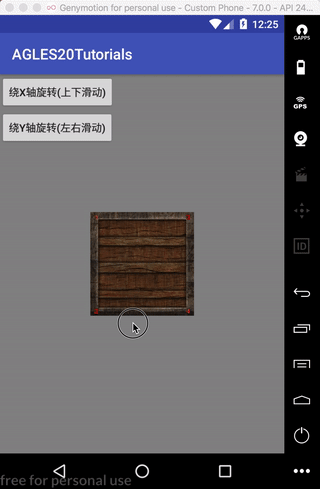
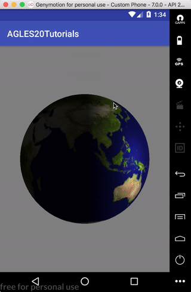

# AGLES20Tutorials
---

Android平台下OpenGL ES 2.0教程代码。
原文[Android OpenGL ES 2.0 Tutorials](https://linuxparachen.gitbooks.io/android-opengl-es-2-0-tutorials/content/)

author：陈占洋

email：<zhanyang.chen@gmail.com>

内容禁止用于商业用途，侵权必究。

案列效果：
1. 三角形绘制

2. 立方体绘制效果

3. 地球绘制效果

5. 摄像头预览效果

[License](https://github.com/LinuxparaChen/AGLES2.0Tutorials/blob/master/LICENSE)

Apache License

Version 2.0, January 2004

http://www.apache.org/licenses/

   TERMS AND CONDITIONS FOR USE, REPRODUCTION, AND DISTRIBUTION

   1. Definitions.

      "License" shall mean the terms and conditions for use, reproduction,
      and distribution as defined by Sections 1 through 9 of this document.

      "Licensor" shall mean the copyright owner or entity authorized by
      the copyright owner that is granting the License.